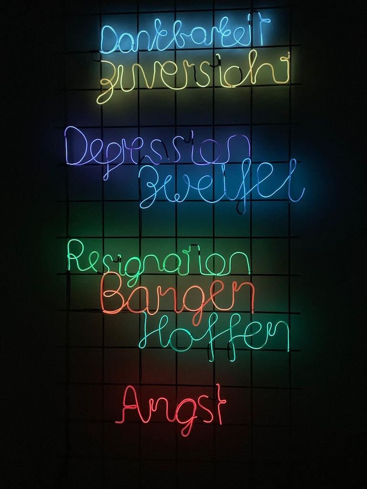
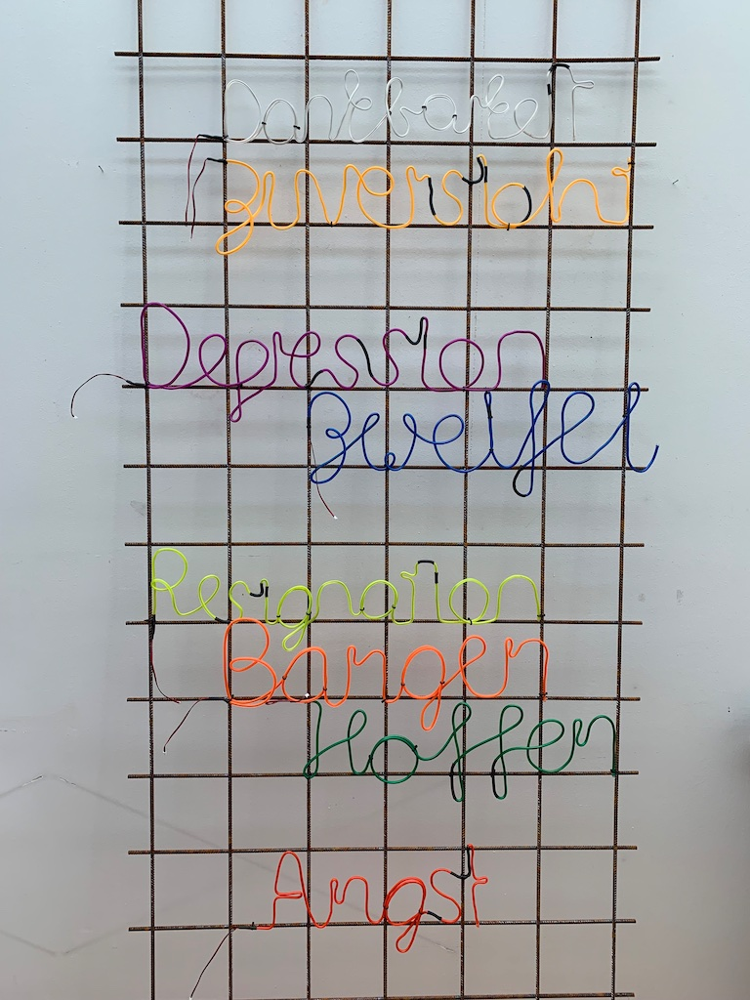

# Curriculum Vitae

An light installation by [Donat Fritschy](https://www.fritschy.ch/), using [Electroluminescent (EL) Wires](https://en.wikipedia.org/wiki/Electroluminescent_wire) 

## Playing

## Installation View

## Hardware
* [Bendable EL Wire](https://www.sparkfun.com/products/14697)
* [Arduino UNO](https://store.arduino.cc/arduino-uno-rev3)
* [SparkFun EL Escudo Dos](https://www.sparkfun.com/products/10878)

## Software
* [This arduino sketch](src/Curriculum_EL_2.ino)
